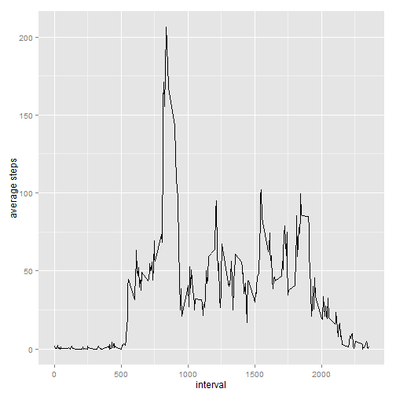

#Assignment

##Loading and preprocessing the data

*Show any code that is needed to*

1. *Load the data (i.e. read.csv())*


```r
setwd("~/github/RepData_PeerAssessment1")
acts <- read.csv("activity.csv")
```

2. *Process/transform the data (if necessary) into a format suitable for your analysis*

Specifying the class of the date variable here will be useful later

```r
acts$date <- as.Date(acts$date)
```

##What is mean total number of steps taken per day?

1. *Make a histogram of the total number of steps taken each day*


```r
by_day <- tapply(acts$steps, acts$date, FUN = "sum")
by_day <- data.frame(names(by_day), by_day)
colnames(by_day)<-c("date", "steps")
by_day$date <- as.Date(by_day$date)
library(ggplot2)
qplot(x = date, y = steps, data = by_day, geom = "histogram", stat="identity")
```

```
## Warning: Removed 8 rows containing missing values (position_stack).
```

 

2. *Calculate and report the mean and median total number of steps taken per day*


```r
mean(by_day$steps, na.rm = TRUE)
```

```
## [1] 10766.19
```

```r
median(by_day$steps, na.rm = TRUE)
```

```
## [1] 10765
```

##What is the average daily activity pattern?

1. *Make a time series plot (i.e. type = "l") of the 5-minute interval (x-axis) and the average number of steps taken, averaged across all days (y-axis)*


```r
by_interval <- tapply(acts$steps, acts$interval, FUN = mean, na.rm = TRUE)
by_interval <- data.frame(as.numeric(names(by_interval)), by_interval)
colnames(by_interval) <-c("interval", "avg_steps") 
qplot(x = interval, y = avg_steps, data = by_interval, geom = "line", ylab = "average steps")
```

 

2. *Which 5-minute interval, on average across all the days in the dataset, contains the maximum number of steps?*


```r
by_interval$interval[by_interval$avg_steps==max(by_interval$avg_steps)]
```

```
## [1] 835
```

##Imputing missing values

1. *Calculate and report the total number of missing values in the dataset (i.e. the total number of rows with NAs)*


```r
sum(is.na(acts))
```

```
## [1] 2304
```

2. *Devise a strategy for filling in all of the missing values in the dataset. The strategy does not need to be sophisticated. For example, you could use the mean/median for that day, or the mean for that 5-minute interval, etc.*

and

3. *Create a new dataset that is equal to the original dataset but with the missing data filled in.*

This code replaces the missing values with the average value for that interval.


```r
acts2 <- acts
for (i in 1:length(acts$steps)) {
    if(is.na(acts$steps[i])) {acts2$steps[i] <- by_interval$avg_steps[by_interval$interval==acts$interval[i]]}
}
```

4. *Make a histogram of the total number of steps taken each day and Calculate and report the mean and median total number of steps taken per day.*


```r
by_day2 <- tapply(acts2$steps, acts2$date, FUN = "sum")
by_day2 <- data.frame(names(by_day2), by_day2)
colnames(by_day2)<-c("date", "steps")
by_day2$date <- as.Date(by_day2$date)
qplot(x = date, y = steps, data = by_day2, geom = "histogram", stat="identity")
```

 

```r
mean(by_day2$steps, na.rm = TRUE)
```

```
## [1] 10766.19
```

```r
median(by_day2$steps, na.rm = TRUE)
```

```
## [1] 10766.19
```

*Do these values differ from the estimates from the first part of the assignment?*

The mean does not change within 2 decimal points. The median rises by 1.19.

*What is the impact of imputing missing data on the estimates of the total daily number of steps?*

Where data is missing it tends to be missing for the entire day. Therefore, on days where the data was previously unavailable, we now see the mean number of steps.

##Are there differences in activity patterns between weekdays and weekends?

1. *Create a new factor variable in the dataset with two levels -- "weekday" and "weekend" indicating whether a given date is a weekday or weekend day.*


```r
acts$daytype <- weekdays(acts$date)
acts$daytype[acts$daytype == "Saturday"| acts$daytype == "Sunday"] <- "weekend"
acts$daytype[!(acts$daytype == "weekend")] <- "weekday"
```

2. *Make a panel plot containing a time series plot (i.e. type = "l") of the 5-minute interval (x-axis) and the average number of steps taken, averaged across all weekday days or weekend days (y-axis).*


```r
comparison <- tapply(acts$steps, list(acts$interval, acts$daytype), FUN = mean, na.rm = TRUE)
comparison <- data.frame(as.numeric(rownames(comparison)), comparison)
colnames(comparison)[1] <- "interval"
c1 <- data.frame(comparison$interval, comparison$weekday, daytype = "weekday")
colnames(c1) <- c("interval", "steps", "daytype")
c2 <- data.frame(comparison$interval, comparison$weekend, daytype = "weekend")
colnames(c2) <- c("interval", "steps", "daytype")
comparison <- rbind(c1,c2)

comp <- ggplot(comparison, aes(x=interval, y=steps)) 
comp + geom_line() + facet_grid(daytype ~ .)
```

 

